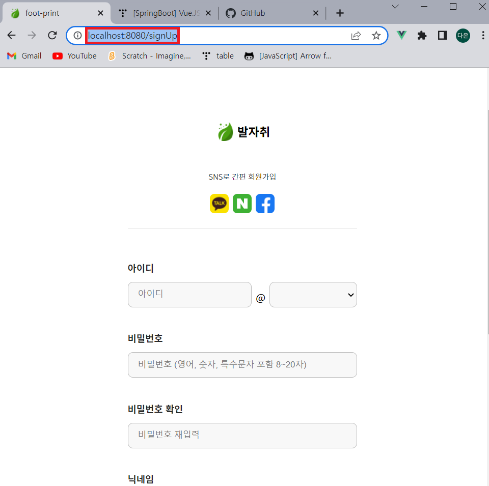

원래는 spring프로젝트랑 vuejs프로젝트랑 연동시켜서 vuejs측에서 빌드하면 spring resources쪽에 결과물이 자동으로 저장되는 구조인데, 아직 정확하게 연동시키지는 못했어여 여러분


그래서 일단 빌드한 vue파일을 spring프로젝트에 수동으로 넣어줘서 개발 진행합시당 프론트 기능 추가될때마다 새로 빌드해서 push할게여


# 수동으로 vue빌드파일 저장하기
- 빌드된 파일들 다운(pull)
- 경로에 맞게 spring 프로젝트에 넣어주기
- controller 생성하여 spring에서 URI로 접근할 수 있도록 설정


## 경로
spring 프로젝트 resources아래로 파일 옮기기

~~*static아래에 html파일 있으면 그 페이지는 홈페이지(http://localhost:8080 으로 접근)
*templates 아래에 html파일 있으면 그 페이지는 thymeleaf 사용하여 접근할 페이지 (http://localhost:8080/signUp 으로 접근)~~

**그냥 static아래로 파일 넣으면 됨**


## controller 생성
spring 프로젝트 src/main/java/controller에 아래 파일 생성
```
//패키지 경로는 알아서 수정하셈
package com.footprints.footprintsback.controller;

import org.springframework.stereotype.Controller;
import org.springframework.web.bind.annotation.GetMapping;

@Controller
public class WebController {

    @GetMapping("signUp")
    public String signUp(){
        return "signUp";
    }
}
```

## 연동 확인
spring 프로젝트 실행시켜 8080포트 켜고

브라우저에서 http://localhost:8080/signUp URI로 접근

아래처럼 나오면 성공임


